## 230310 - 미니콘다(Miniconda) 설치 및 크롤링 예제 - Ubuntu 22.04 LTS


### Crawling example using python BeautifulSoup, requests

```
$ sudo apt-get update
```

```
$ cd /tmp
```

```
$ sudo apt-get install wget
```

```
$ wget https://repo.anaconda.com/miniconda/Miniconda3-latest-Linux-x86_64.sh
```

```
$ sha256sum Miniconda3-latest-Linux-x86_64.sh
```

```
$ bash Miniconda3-latest-Linux-x86_64.sh
```

```
$ source ~/.bashrc
```

```
$ conda info
```

```
$ conda update conda
```

```
$ conda update --all
```

```
$ conda info --envs
```

```
$ conda activate 가상환경이름
```

```
$ conda install 모듈이름
```

```
$ pip install bs4
```

```
$ conda list
```

```
$ mkdir crawling
$ cd crawling
$ vi crawling.py
```
```python3
import requests
from bs4 import BeautifulSoup as bs


# 페이스북 메인 페이지 문구 크롤링
page = requests.get('https://ko-kr.facebook.com')
soup = bs(page.text, "html.parser")
element = soup.select('._8eso')
print(element)
```
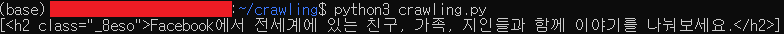


## 230313 - VMware를 사용하지 않고 WSL을 사용하여 Windows에 Linux 설치

### wsl 설치
```
$ wsl --install
```

### 설치 가능한 배포 목록 보기
```
$ wsl --list --online
```
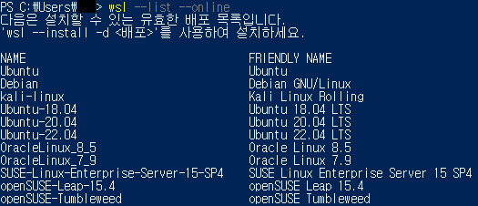

### Ubuntu-22.04 설치 및 계정 설정
```
$ wsl --install -d Ubuntu-22.04
```
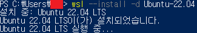
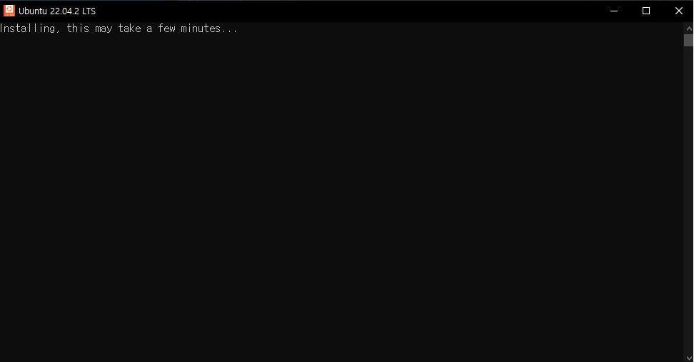
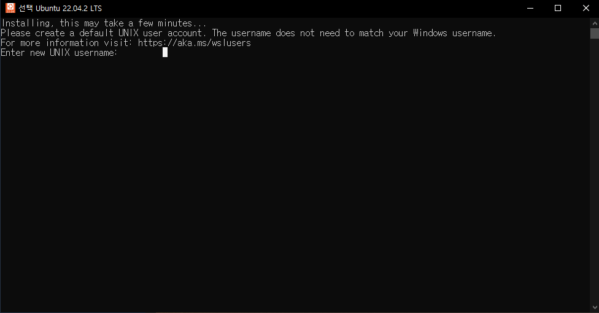

### Ubuntu-22.04 설치 완료 확인
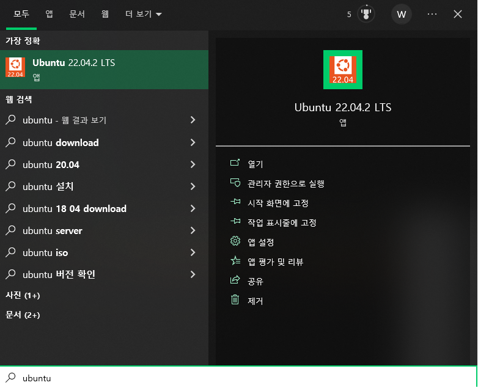
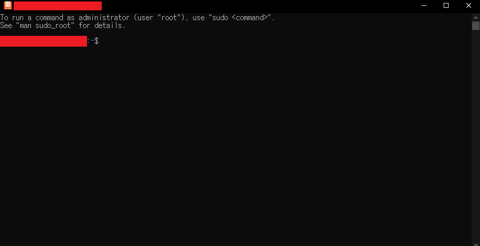


## 230314 - WSL - Jupyter Notebook(or JupyterLab) 사용하기(WSL2)

### 패키지 업데이트
```
// update: 설치된 패키지의 새로운 버전이 존재하는지 확인
// upgrade: apt-get update로 가져온 각 패키지를 최신 버전으로 업그레이드
$ sudo apt update -y && sudo apt upgrade -y
```

### python3, pip3 설치
```
// python3이 설치되어 있다면
$ sudo apt-mark auto python3
$ sudo apt install python3-pip

// python3가 설치되어 있지 않다면
$ sudo apt install python3 python3-pip
$ sudo apt-mark auto python3
```

### jupyterlab 설치 
```
$ pip install jupyterlab
```

### jupyterlab 실행
```
$ jupyter-lab
```
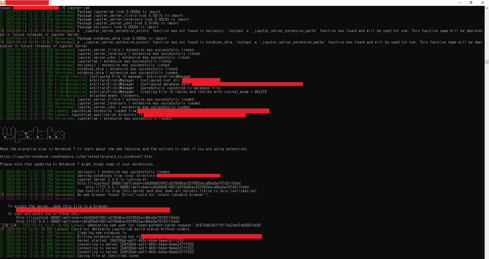


## 230315 - sudo 권한 없이 pip 설치하기

- `sudo 권한이 주어지지 않은 상황`에서 pip를 설치해야 할 때 사용할 수 있는 방법 중 하나입니다.
- pip은 파이썬 패키지 라이브러리를 설치 및 관리하는 시스템입니다.

### wget으로 get-pip.py 파일 설치
```
// wget(web get): 웹 서버로부터 파일을 다운로드
$ wget https //bootstrap.pypa.io/get-pip.py
```
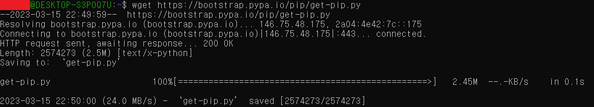

### get-pip.py 파일 확인
```
$ ls -al
```
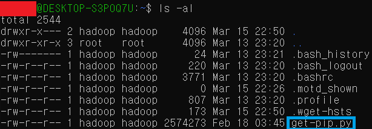

### pip 설치
```
$ python3 get-pip.py
```
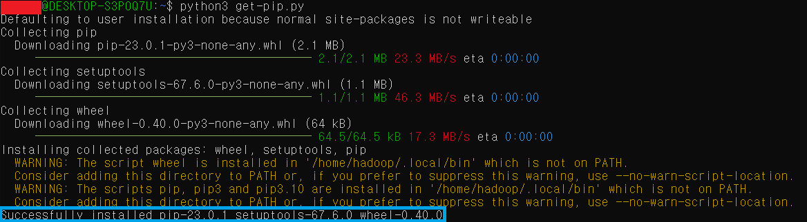


## 230316 - PySpark Tutorial

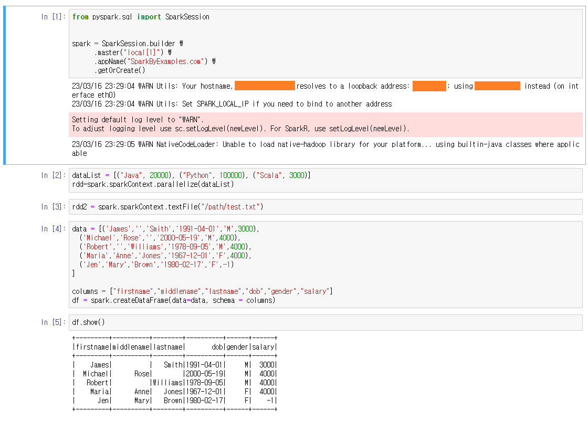
